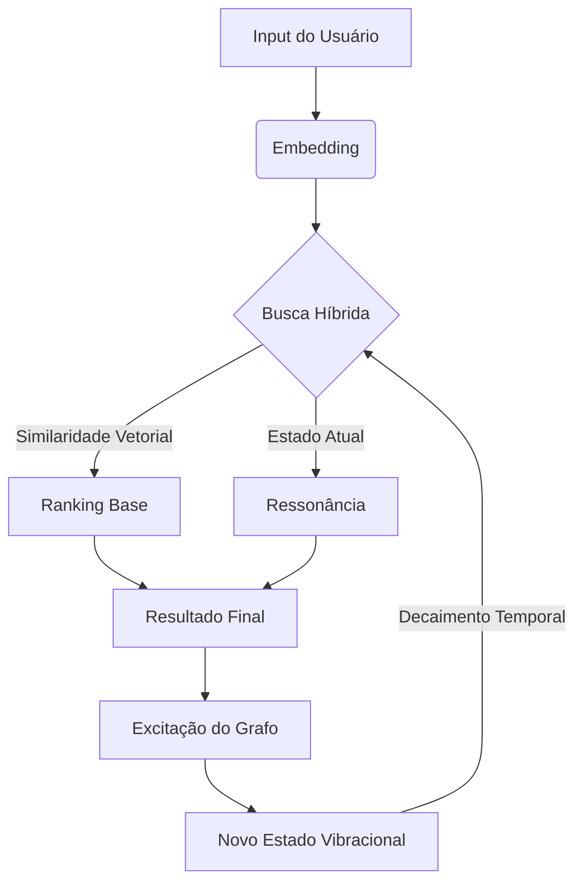

# 🧠 Banco Vibracional (Vibrational DB)

> **RAG com Memória de Estado e Ressonância Contextual.**
> Um banco de dados vetorial "Stateful" que imita a persistência cognitiva e a inércia de pensamento.


## 🧐 O que é?

A maioria dos sistemas RAG (Retrieval-Augmented Generation) atuais são **Stateless** (sem estado). Cada consulta é tratada isoladamente, sem memória do que foi dito 10 segundos atrás.

O **Banco Vibracional** é diferente. Ele combina busca vetorial (embeddings) com **Análise Espectral de Grafos** para criar uma "memória de curto prazo".

Imagine o banco de dados como um cristal ou uma teia. Quando você acessa um conceito, ele "vibra". Essa vibração se espalha para conceitos relacionados e **persiste** por um tempo (decaimento), influenciando as próximas buscas.

### Principais Diferenciais

1.  **Inércia Cognitiva:** O sistema tende a manter o assunto. Se você está falando sobre *Natureza*, a palavra "Rede" será interpretada como *Rede de Pesca*, não *Rede Wi-Fi*.
2.  **Ressonância Seletiva:** O estado vibracional atua como um filtro ativo. Ele não apenas impulsiona o contexto correto, mas **suprime** (penaliza) significados irrelevantes para o momento.
3.  **Memória de Curto Prazo:** O contexto decai naturalmente com o tempo (`decay`), permitindo transições suaves de assunto, similar a uma conversa humana.

---

## 🚀 Como Funciona (A "Física" do Sistema)

O sistema opera em três camadas:

1.  **Camada Vetorial (Estática):** Usa `SentenceTransformers` para calcular a similaridade semântica base (cosseno).
2.  **Camada Espectral (Estrutural):** Usa a Laplaciana do grafo de conceitos para entender a topologia dos dados (quais clusters estão conectados).
3.  **Camada Vibracional (Dinâmica):** Mantém um vetor de estado (`db.state`) que evolui a cada interação.

### Fluxo de Interação



---

## ⚡ Quick Start

### 1. Ingestão de Dados
Primeiro, precisamos criar o "cérebro" baixando dados (ex: Wikipedia) e criando o grafo.

```bash
# 1. Baixar artigos (IA e Natureza para criar ambiguidade)
python -m src.coletar_wikipedia

# 2. Processar e criar o Cristal Vibracional
python -m src.ingestao_incremental data/ia_wikipedia data/cristal_vibracional
```

### 2. Chat com LLM (RAG Vibracional)
Converse com o sistema e veja a memória em ação. O script abaixo simula uma LLM ou conecta-se à OpenAI se configurado.

```bash
python -m src.chat_llm
```

---

## 📊 Benchmark: Vibracional vs Tradicional

O script `tests/demo_comparativo.py` demonstra a superioridade do método em cenários de ambiguidade.

**Cenário:** O contexto anterior era "Oceanos e Pescaria".
**Pergunta:** "Problemas na rede".

| Método | Resultado Top 1 | Explicação |
| :--- | :--- | :--- |
| **RAG Padrão (Pinecone/Chroma)** | *"A latência da rede wi-fi..."* | ❌ Falhou. Ignorou o contexto e trouxe o viés do treino (Tech). |
| **RAG Vibracional** | *"A rede de emalhar é proibida..."* | ✅ Sucesso. O estado vibracional de "Oceano" ressoou com "Rede de Pesca". |

Para rodar este teste:
```bash
python -m tests.demo_comparativo
```

---

## 🧠 Exemplo de Código

```python
from src.banco_vibracional import VibrationalDB

# Inicializa
db = VibrationalDB()
db.adicionar_conceitos([
    "O pescador usa a rede no mar", 
    "O sysadmin configura a rede wi-fi"
])
db.recalcular_espectro()

# 1. Excita o contexto de natureza
db.excite("oceanos e peixes", diffusion_time=0.5)

# 2. Consulta ambígua
# O sistema usa o estado para desambiguar "rede"
res = db.query_with_state("a rede quebrou", gamma=2.0)

print(res[0]['texto']) 
# Saída provável: "O pescador usa a rede no mar"
```

## 📄 Licença

Este projeto está sob a licença MIT.